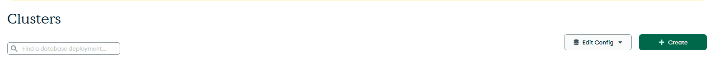
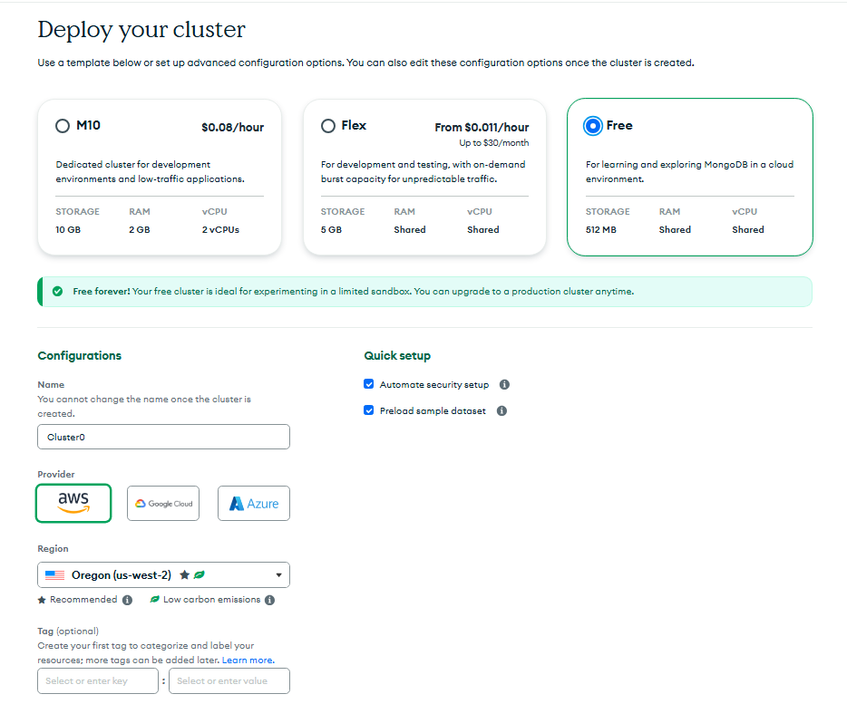
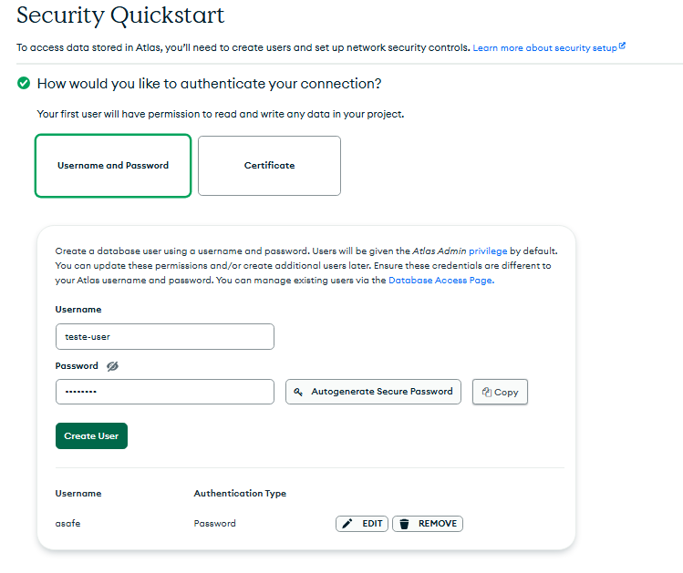
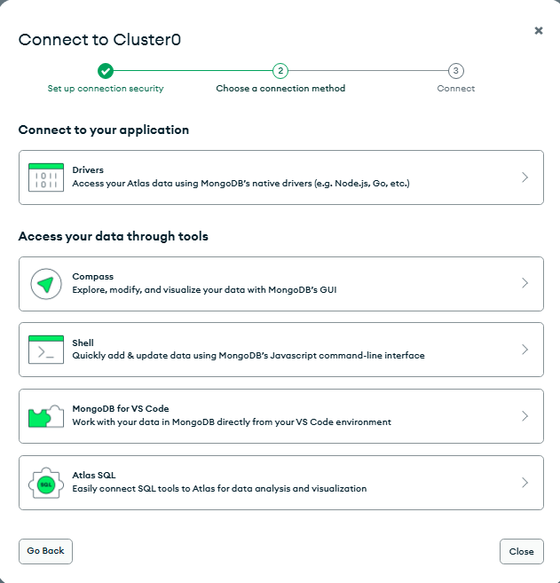
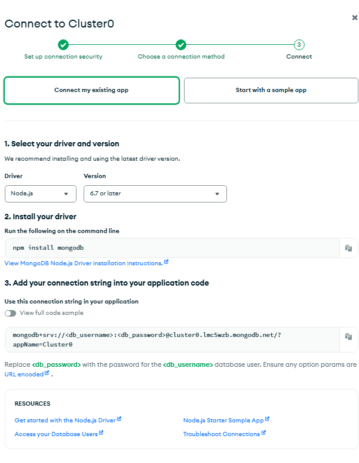
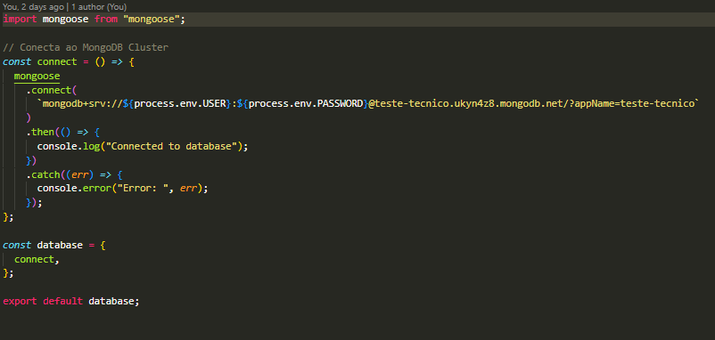

# teste-tecnico-fractal

Fractal Web App

Descrição do Projeto

Projeto full stack para teste tecnico, o App permite criar, editar, deletar,visualizar os lacres criados e filtrar lacres por valores: codigo e ecp

Conectando ao Cluster:

Crie uma conta em: https://www.mongodb.com/cloud/atlas/register

Crie seu Cluster clicando no botão 'Create +'

Selecione o plano desejado, escolha o nome do seu Cluster e clique em 'Create deployment'

Defina o nome e senha do seu usuario

Agora novamente na aba Clusters clique em 'connect'

Agora clique em 'Drivers' e copie a connection string como essa: mongodb+srv://<db_username>:<db_password>@cluster0.lmc5wzb.mongodb.net/?appName=Cluster0

Substitua <db_username> pelo seu usuario e <db_password> pela sua senha respectivamente

No arquivo ./server/infra/database.js substitua a string dentro de mongoose.connect() com a string que você copiou e coloque suas credenciais

Pronto seu setup para conectar ao banco de dados está completo, agora instale as dependências do projeto!

Instalando dependencias

Run npm install em test-tecnico-fractal
cd client
Run npm install
cd server
Run npm install
cd ../
Run npm run dev para inciar projeto

cd server
Run npm test para rodar bateria de testes automatizados

Tecnologias utilizadas

Back-End:
Node.js
Express.js
Cors
Nodemon
Jest.js
Mongoose

Front-End:
React.js
React-Icons
React-Router-Dom|
Tailwindcss

Relatório

Validação de campos front-end:

Input são required
API testada via insomnia durante processo de desenvolvimento
Estruturas de pastas em padrão MVC
Devem ser preenchidos com text válido
Não aceita submit vazio
Campo 'Ativo' limitado select booleano de true ou false
Filtro por texto .toLowerCase() para evitar erros de digitação

Validação de dados back-end:

Tipos de dados especificados no Schema da tabela
Definido casto como false em Schema para evitar conversao automatica de campo pelo mongoose
Trata valor de dado 'ativo' como default 'false' para tratar de requisições com apenas 'codigo' e 'ecp'
Teste automatizado de POST para certificar que servidor não aceita requisições de tipos inválidos
Linhas documentadas com comentários com descrição da função de cada bloco de código
